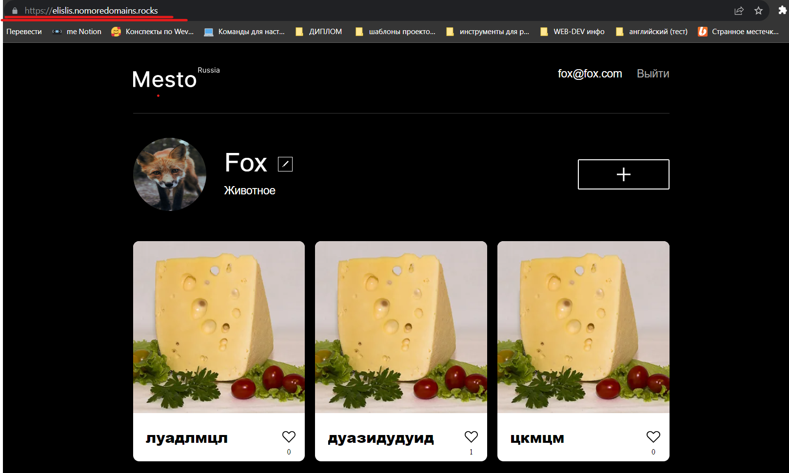

<h1 align="center">"Mesto React"</h1>
<h3 align="center">Седьмая проектная работа</h3>
<h4 align="center">Backend + Frontend parts</h4>

## Описание проекта

Данный учебный проект от [Я.Практикум](https://practicum.yandex.ru/web/) представляет собой приложения проекта `Mesto`, включающий фронтенд и бэкенд части приложения со следующими возможностями: авторизации и регистрации пользователей, операции с карточками и пользователями. 

Бэкенд расположен в директории `backend/` и данная часть приложения, написанная на NodeJS;

Фронтенд расположен в директории `frontend/` данная часть приложения, написанная на React; 

<h3 align="center">1. Настройка и деплой backend</h3>

Данная практическая работа включала в себя следующие действия:
- Реализовать логирование запросов и ошибок;
- Объединить фронтенд и бэкенд части приложения;
- Создать облачный сервер и развернуть API (для создания облачного сервера была использована платформа Яндекс.Облако);
- Создать .env-файл;
- Создать домен и прикрепить его к серверу;
- Выпустить и подключить SSL-сертификата;

## Ссылка на репозиторий

https://github.com/elislis7/react-mesto-api-full-gha

## Ссылки на сайт

IP 158.160.72.249

Frontend https://elislis.nomoredomains.rocks

Backend https://api.elislis.nomoredomains.rocks
